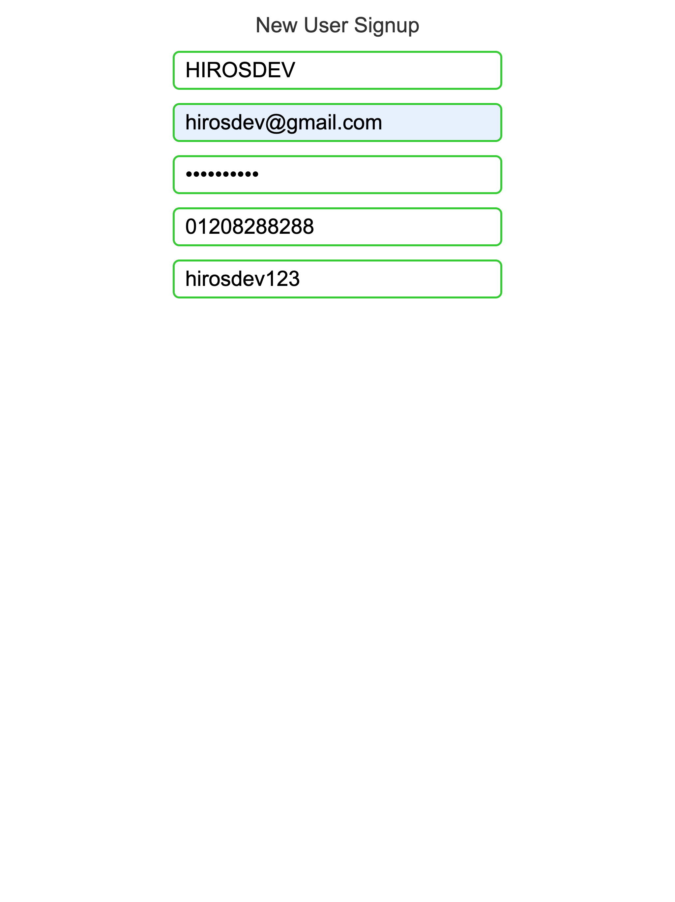
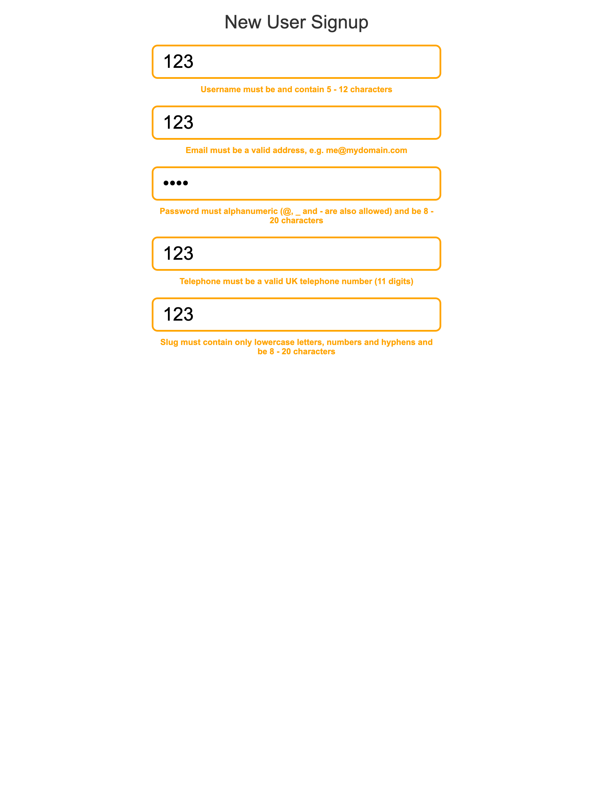

# Regex

## ScreenShot of the project

## Detail of the project

Regular Expressions (RegEx) Tutorial in Youtube.
https://www.youtube.com/watch?v=r6I-Ahc0HB4

## Purpose of the project

Get the knowledge of Regex fundamentals.
It is use Regex with Javascript.

## Demo

https://hiros-dev.github.io/Regex/

## What did I learn from this project?

Regex fundamentals

How to use Regex with JavaScript

## Impressions

I spend wonderful time with this tutorials.

I learned tons of things about Regex from this project.
And I wrote simple report in regex.md file.

This Regex course is most useful course on this planet and it is not exaggeration.
Of course, I can not Regex perfectly.
But now, i have full confidence about Regex and I would like to use Regex in my project or to solve algorithm problem(like a CodeWars site).

Thank you for reading. And, happy coding!!!
